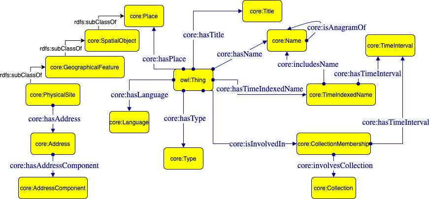
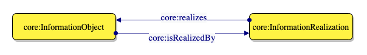

# Core

An ontology for general and foundational concepts and relations (e.g. place, time, classification)

[](https://zenodo.org/badge/latestdoi/372536364)
[](https://creativecommons.org/licenses/by/4.0/)

> 🔗 Ontology URI: [https://w3id.org/polifonia/ontology/core/](https://w3id.org/polifonia/ontology/core/)

The Core ontology models general-purpose concepts, relationships and ontology design patterns (e.g. place, time, classification, situation), which are orthogonal to the whole Polifonia ontology network. Indeed, it is imported and possibly specialised by the other ontology modules of the network.



### Information Realization ODP



## Competency questions addressed

| **ID** | **Competency Question**                                                                                                                    |
|--------|--------------------------------------------------------------------------------------------------------------------------------------------|
| CQ1    | Which is the title of an entity?     |
| CQ2    |  Which is the name of an entity?      |
| CQ3    | Which is the place of an entity?          |
| CQ4    | Which is the address of a physical site?          |
| CQ5    | Which are the components of an address?         |
| CQ6    | Which are the parts of an entity?         |
| CQ7    | Which is the language of an entity?         |
| CQ8    | Which is the name of an entity during a specific time interval?         |
| CQ9    | Which is the type of an entity?         |
| CQ10    | Which is the anagram of a name?         |
| CQ11    | Which are the members of a collection during a specific time interval?         |
| CQ12    | By which realization is an information object realized?         |


## Examples of SPARQL queries
- Which is the name of an entity during a specific time interval?
```
PREFIX core: <https://w3id.org/polifonia/ontology/core/>
SELECT DISTINCT ?entity ?entityName ?time
WHERE { ?timeindexedname core:includesName ?entityName ;
core:hasTimeInterval ?time ; 
core:isTimeIndexedNameOf ?entity .
}
```

## Aligned ontologies
- [DUL](http://www.ontologydesignpatterns.org/ont/dul/DUL.owl)

## Statistics
- number of classes: 49 
- number of object properties: 75
- number of datatype properties: 13
- number of logical axioms: 265

## License

This work is licensed under a [Creative Commons Attribution 4.0 International License][http://creativecommons.org/licenses/by/4.0/].
